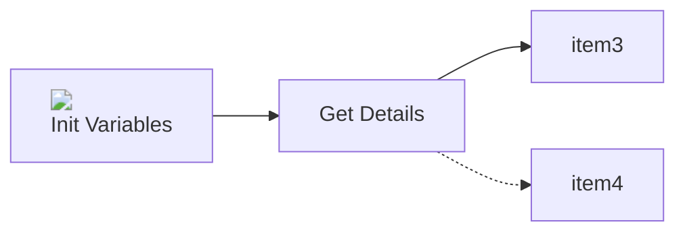

# Create AVI Load Balancer - Workflow Documentation

<details>
<summary><h2>Workflow Details</h2></summary>

- **Workflow Name:** Create AVI Load Balancer
- **Workflow ID:** `e06ecd6e-df7d-470d-8249-3bb52f2845a6`
- **Version:** 0.0.0
- **Description:** _No description provided_
</details>

<details>
<summary><h2>Workflow Variables</h2></summary>

| Name | Type |
| --- | --- |
| aviVersion | string |
| aviCreds | Properties |
| aviUrl | string |
| serverList | Array/string |
| health_payload | string |
| health_name | string |
| uuid | string |
| healthMonitor | string |
| poolPayload | Properties |
| pool | string |
| vipPayload | Properties |
| vsvip | string |
| vsPayload | Properties |
| aviTenant | Properties |
</details>

<details>
<summary><h2>Workflow Inputs</h2></summary>

| Name | Type |
| --- | --- |
| manualServers | Array/string |
| selectedVMs | Array/string |
| useVMSelection | boolean |
| useExistingHealthMonitor | boolean |
| existingHealthMonitor | string |
| health_monitor_type | string |
| healthPort | string |
| command_code | string |
| command_parameters | string |
| command_path | string |
| command_variables | string |
| lb_algorithm | string |
| poolPort | string |
| useExistingPool | boolean |
| existingPool | string |
| networkType | string |
| ipAddress | string |
| cloud | string |
| tier1_lr | string |
| serviceEngineGroup | string |
| vrfContext | string |
| network | string |
| networkSegment | string |
| vipIPRange | string |
</details>

<details>
<summary><h2>Workflow Form</h2></summary>

| ID | Label | Type | Required | Pattern | Default | Params | Value List | Signpost | State |
| --- | --- | --- | --- | --- | --- | --- | --- | --- | --- |
| cloud | Cloud | string | Optional |  | Action: net.atos.dhc.automation/getAVIClouds |  | n/a |  | {"visible":false,"read-only":true} |
| serviceEngineGroup | Service Engine Group | string | Required |  | n/a |  | Action: net.atos.dhc.automation/getAVISeGroups | Select the appropriate Service Engine Group that configures the pool of service engines for your Avi load balancer. Each group defines specific settings such as scaling policies, resource allocations, and performance parameters. Choose the group that best matches your deployment requirements. | {"visible":true,"read-only":false} |
| networkSegment | Network Segment | string | Required |  | n/a |  | Action: net.atos.dhc.automation/getAVINetworksProfile | Select the appropriate network segment where the load balancer will be deployed. This dropdown lists the available subnets configured in your environment. Choosing the correct segment ensures that your load balancer operates within the intended network scope and meets your deployment requirements. | {"visible":true,"read-only":false} |
| tier1_lr | Tier1_LR | string | Optional |  | Action: net.atos.dhc.automation/getAVICloudRtr | segment→networkSegment, clouduuid→cloud | n/a |  | {"visible":false,"read-only":true} |
| useExistingPool | Do you want use Existing Pool? | boolean | Optional |  | n/a |  | n/a | Select this checkbox if you want to deploy the load balancer using a pre-configured pool. When enabled, the system will reference an existing pool rather than creating a new one, ensuring consistency with established settings. If you leave it unchecked, a new pool will be generated based on the parameters you provide. | {"visible":true,"read-only":false} |
| existingPool | Pool | string | Required if useExistingPool equals true |  | n/a |  | Action: net.atos.dhc.automation/getAVIPools | Select the appropriate existing pool from the dropdown list. This field displays the pools that have already been configured in your environment, each with its own set of load balancing rules, backend server configurations, and performance parameters. | {"read-only":false,"visible":[{"equals":{"useExistingPool":true},"value":true}]} |
| poolPort | Pool port | string | Required if useExistingPool equals false | `^((6553[0-5]\|655[0-2]\d\|65[0-4]\d{2}\|6[0-4]\d{3}\|[1-5]?\d{1,4}\|0)(-(6553[0-5]\|655[0-2]\d\|65[0-4]\d{2}\|6[0-4]\d{3}\|[1-5]?\d{1,4}\|0))?\|(\[(6553[0-5]\|655[0-2]\d\|65[0-4]\d{2}\|6[0-4]\d{3}\|[1-5]?\d{1,4}\|0)-(6553[0-5]\|655[0-2]\d\|65[0-4]\d{2}\|6[0-4]\d{3}\|[1-5]?\d{1,4}\|0)\]))$` | n/a |  | n/a | Enter the port number on which the new pool will accept incoming traffic. This value is critical for directing client requests to the correct backend servers. Ensure the chosen port aligns with your application's configuration, is open, and does not conflict with other services. | {"read-only":false,"visible":[{"equals":{"useExistingPool":false},"value":true},{"equals":{"useExistingPool":true},"value":false}]} |
| manualServers | Servers for Pool | string[] | Optional | `^(25[0-5]\|2[0-4]\d\|[01]?\d\d?)\.(25[0-5]\|2[0-4]\d\|[01]?\d\d?)\.(25[0-5]\|2[0-4]\d\|[01]?\d\d?)\.(25[0-5]\|2[0-4]\d\|[01]?\d\d?)$` | n/a |  | n/a | Enter the backend server details manually. Provide each server’s IP address.Ensure that each entry corresponds to a properly configured and reachable server that meets your application’s requirements. | {"read-only":false,"visible":[{"equals":{"useExistingPool":true},"value":false},{"equals":{"useExistingPool":false},"value":true}]} |
| useVMSelection | Do you want choose Servers from List? | boolean | Optional |  | n/a |  | n/a | Select this checkbox if you prefer to choose servers from an existing list rather than manually entering server details. When enabled, a predefined list of validated servers will be available for selection, helping to streamline the configuration process and reduce manual errors. | {"read-only":false,"visible":[{"equals":{"useExistingPool":false},"value":true},{"equals":{"useExistingPool":true},"value":false}]} |
| selectedVMs | List of Virtual Machine | string[] | Optional |  | n/a |  | Action: net.atos.dhc.firewall.manage/returnVirtualMachineListwithIP | Use this dual-list control to manage your virtual machine selection. The left side displays all available virtual machines, while the right side shows the ones chosen for the deployment. Move items between lists using the provided controls to add or remove virtual machines as needed. Ensure that the selected VMs are properly configured for your environment. | {"read-only":false,"visible":[{"equals":{"useVMSelection":true},"value":true},{"equals":{"useExistingPool":true},"value":false}]} |
| lb_algorithm | Load Balancer Algorithm | string | Required if useExistingPool equals false |  | n/a |  | LB_ALGORITHM_ROUND_ROBIN, LB_ALGORITHM_LEAST_CONNECTIONS, LB_ALGORITHM_SOURCE_IP, LB_ALGORITHM_CONSISTENT_HASH, LB_ALGORITHM_RANDOM | Select the appropriate algorithm for distributing traffic among backend servers. This dropdown lists available algorithms—such as Round Robin, Least Connections —that determine how requests are allocated. Choose the algorithm that best aligns with your application’s performance, reliability, and scaling requirements. | {"read-only":false,"visible":[{"equals":{"useExistingPool":false},"value":true}]} |
| useExistingHealthMonitor | Do you want use existing Health Monitor ? | boolean | Optional |  | n/a |  | n/a | Select this checkbox if you wish to use a pre-configured health monitor to assess the status and performance of your backend servers. When enabled, the deployment will reference an existing health monitor configuration, saving you time and ensuring consistency. If you leave it unchecked, a new health monitor will be created based on your specified settings. | {"visible":true,"read-only":false} |
| existingHealthMonitor | Existing Health Monitor | string | Required if useExistingHealthMonitor equals true |  | n/a |  | Action: net.atos.dhc.automation/getAVIHealthMonitor | Select an existing health monitor from the dropdown list. These monitors are pre-configured to regularly check the availability and performance of your backend servers. Each monitor is set up with specific parameters—such as health check intervals, timeout values, and criteria for determining server status | {"read-only":false,"visible":[{"equals":{"useExistingHealthMonitor":true},"value":true}]} |
| health_monitor_type | Health Monitor Type | string | Required if useExistingHealthMonitor equals false |  | n/a |  | HEALTH_MONITOR_HTTP, HEALTH_MONITOR_HTTPS, HEALTH_MONITOR_TCP, HEALTH_MONITOR_ICMP, HEALTH_MONITOR_EXTERNAL | Select the appropriate type of health monitor for your deployment. This dropdown allows you to choose the protocol or method—such as HTTP, TCP, or ICMP—that will be used to check the availability and responsiveness of your backend servers. | {"read-only":false,"visible":[{"equals":{"useExistingHealthMonitor":true},"value":false},{"equals":{"useExistingHealthMonitor":false},"value":true}]} |
| healthPort | Port for Health Monitor | string | Optional | `^((6553[0-5]\|655[0-2]\d\|65[0-4]\d{2}\|6[0-4]\d{3}\|[1-5]?\d{1,4}\|0)(-(6553[0-5]\|655[0-2]\d\|65[0-4]\d{2}\|6[0-4]\d{3}\|[1-5]?\d{1,4}\|0))?\|(\[(6553[0-5]\|655[0-2]\d\|65[0-4]\d{2}\|6[0-4]\d{3}\|[1-5]?\d{1,4}\|0)-(6553[0-5]\|655[0-2]\d\|65[0-4]\d{2}\|6[0-4]\d{3}\|[1-5]?\d{1,4}\|0)\]))$` | n/a |  | n/a | Enter the specific port number that the health monitor will use to perform health checks on your backend servers. This port should be actively configured to respond to health requests, ensuring that the monitor can accurately assess server status. | {"read-only":false,"visible":[{"equals":{"useExistingHealthMonitor":false},"value":true},{"equals":{"useExistingHealthMonitor":true},"value":false}]} |
| command_code | Code for External Health Monitor | string | Optional |  | n/a |  | n/a | Enter or paste the custom script or code that defines how your external health monitor operates. This code should implement the necessary logic to perform health checks on your backend servers, including error handling and logging as needed. | {"read-only":false,"visible":[{"equals":{"health_monitor_type":"HEALTH_MONITOR_EXTERNAL"},"value":true},{"notEqual":{"health_monitor_type":"HEALTH_MONITOR_EXTERNAL"},"value":false}]} |
| command_parameters | Parameters for External Health Monitor | string | Optional |  | n/a |  | n/a | Provide the necessary parameters that your external health monitor requires to function correctly. These parameters might include configuration settings such as timeout values, thresholds, or custom environment variables. | {"read-only":false,"visible":[{"equals":{"health_monitor_type":"HEALTH_MONITOR_EXTERNAL"},"value":true},{"notEqual":{"health_monitor_type":"HEALTH_MONITOR_EXTERNAL"},"value":false}]} |
| command_path | Path for External Health Monitor | string | Optional |  | n/a |  | n/a | Enter the file system path or URL where your external health monitor code is located. This field should point to the exact location of the executable or script that performs health checks. | {"read-only":false,"visible":[{"equals":{"health_monitor_type":"HEALTH_MONITOR_EXTERNAL"},"value":true},{"notEqual":{"health_monitor_type":"HEALTH_MONITOR_EXTERNAL"},"value":false}]} |
| command_variables | Variables for External Health Monitor | string | Optional |  | n/a |  | n/a | Provide any additional variables that your external health monitor requires to function correctly. | {"read-only":false,"visible":[{"equals":{"health_monitor_type":"HEALTH_MONITOR_EXTERNAL"},"value":true},{"notEqual":{"health_monitor_type":"HEALTH_MONITOR_EXTERNAL"},"value":false}]} |
| networkType | Type of Network for VIP | string | Optional |  | n/a |  | Static IP, Dynamic IP | Select whether the VIP should use a Static IP or a Dynamic IP. Choosing Static IP requires you to manually assign a fixed IP address, ensuring consistency and control over your deployment. Opting for Dynamic IP will allow the system to automatically allocate an IP address from the available network pool, providing flexibility and ease of management. | {"visible":true,"read-only":false} |
| ipAddress | VIP IP Address | string | Required if networkType equals Static IP | `^(25[0-5]\|2[0-4]\d\|[01]?\d\d?)\.(25[0-5]\|2[0-4]\d\|[01]?\d\d?)\.(25[0-5]\|2[0-4]\d\|[01]?\d\d?)\.(25[0-5]\|2[0-4]\d\|[01]?\d\d?)$` | n/a |  | n/a | Enter the Virtual IP (VIP) address that your load balancer will use. | {"read-only":false,"visible":[{"equals":{"networkType":"Static IP"},"value":true},{"notEqual":{"networkType":"Static IP"},"value":false}]} |
| vipIPRange | VIP IP Range | string | Optional |  | Action: net.atos.dhc.automation/getAVINetworkDetails | segment→networkSegment, connectivityPathInput→tier1_lr, clouduuid→cloud | n/a |  | {"read-only":true,"visible":[{"equals":{"networkType":"Dynamic IP"},"value":true},{"equals":{"ipAddress":"Static IP"},"value":false}]} |
</details>

<details>
<summary><h2>Workflow Elements</h2></summary>

#### Element: item0
- **Type:** end
- **Description:** _No description provided_
- **Element ID:** item0


---

#### Element: initVariables
- **Type:** task
- **Description:** Simple task with custom script capability.
- **Element ID:** item1

**Output Bindings:**

| Variable Name | Type | Workflow Variable |
| --- | --- | --- |
| aviVersion | string | aviVersion |
| aviCreds | Properties | aviCreds |
| aviUrl | string | aviUrl |
| uuid | string | uuid |
| aviTenant | Properties | aviTenant |

**Script:**

```javascript
try {

    var automationModule = System.getModule("net.atos.dhc.automation");
    if (automationModule === null || automationModule === undefined) {
        throw new Error("Module 'net.atos.dhc.automation' is not available.");
    }
    
    var aviVersion = automationModule.getAVIVersion();
    if (aviVersion === null || aviVersion === undefined || (typeof aviVersion === "string" && aviVersion.trim() === "")) {
        throw new Error("aviVersion is required but not provided or is empty.");
    }
    
    var aviCreds = automationModule.getAviCreds();

    
    var aviUrl = automationModule.configElement("DHC", "SSRConfig", "aviServer");
    if (aviUrl === null || aviUrl === undefined || (typeof aviUrl === "string" && aviUrl.trim() === "")) {
        throw new Error("aviUrl is required but not provided or is empty.");
    }

    System.log(" [INFO] AVI Version: " + aviVersion + " / AVI URL: " + aviUrl);
    

    var aviTenant = automationModule.getAVITenantRef();
    System.log("AVI tenant reference: "+aviTenant.label +" with id: "+aviTenant.value)
    if (!aviTenant || !aviTenant.label) {
        throw new Error("AVI tenant reference or label is missing.");
    }

    var uuid = java.util.UUID.randomUUID().toString();
    timestamp = new Date().toISOString();
    System.log(" [INFO] Generated UUID: " + uuid);


    
} catch (e) {

    var timestamp = new Date().toISOString();
    System.log(" [ERROR] An error occurred during script execution: " + e.message);
    throw e;
}
```


---

#### Element: mergeServers
- **Type:** task
- **Description:** Simple task with custom script capability.
- **Element ID:** item2

**Input Bindings:**

| Variable Name | Type | Workflow Variable |
| --- | --- | --- |
| useVMSelection | boolean | useVMSelection |
| manualServers | Array/string | manualServers |
| selectedVMs | Array/string | selectedVMs |

**Output Bindings:**

| Variable Name | Type | Workflow Variable |
| --- | --- | --- |
| serverList | Array/string | serverList |

**Script:**

```javascript
try {
    var manualServers = manualServers || [];
    
    var selectedVMs = selectedVMs || [];

    var combined = manualServers.concat(useVMSelection ? selectedVMs : []);

    var deduped = [];
    for (var i = 0; i < combined.length; i++) {
        if (deduped.indexOf(combined[i]) === -1) {
            deduped.push(combined[i]);
        }
    }
    
    serverList = deduped;
    System.log(" [INFO] Merged Server List: " + JSON.stringify(serverList));
} catch (e) {
    System.log(" [ERROR] An error occurred during server list merging: " + e.message);
    throw e;
}
```


---

#### Element: determineHealthMonitor
- **Type:** task
- **Description:** Simple task with custom script capability.
- **Element ID:** item3

**Input Bindings:**

| Variable Name | Type | Workflow Variable |
| --- | --- | --- |
| useExistingHealthMonitor | boolean | useExistingHealthMonitor |
| health_monitor_type | string | health_monitor_type |
| healthPort | string | healthPort |
| command_code | string | command_code |
| command_variables | string | command_variables |
| command_parameters | string | command_parameters |
| command_path | string | command_path |
| uuid | string | uuid |
| existingHealthMonitor | string | existingHealthMonitor |
| aviTenant | Properties | aviTenant |

**Output Bindings:**

| Variable Name | Type | Workflow Variable |
| --- | --- | --- |
| health_payload | string | health_payload |
| health_name | string | health_name |
| healthMonitor | string | healthMonitor |

**Script:**

```javascript
try {
    if (useExistingHealthMonitor) {
        healthMonitor = existingHealthMonitor;
        System.log(" [INFO] Using existing health monitor: " + healthMonitor);
    } else {
        if (health_monitor_type == "HEALTH_MONITOR_EXTERNAL") {
            var health_payload = {
                "name": "external-monitor-" + uuid,
                "type": health_monitor_type,
                "monitor_port": healthPort,
                "tenant_ref":aviTenant.value,
                "external_monitor": {
                    "command_code": command_code,
                    "command_parameters": command_parameters,
                    "command_path": command_path,
                    "command_variables": command_variables
                }
            };
            var body = JSON.stringify(health_payload);
            System.log(" [INFO] Creating External Health Monitor: " + body);
        } else {
            var health_payload = {
                "name": "standard-monitor-" + uuid,
                "type": health_monitor_type,
                "monitor_port": healthPort,
                "monitor_port": healthPort
            };
            var body = JSON.stringify(health_payload);
            System.log(" [INFO] Creating Standard Health Monitor: " + body);
        }
        health_name = health_payload.name;
    }
} catch (e) {
    System.log(" [ERROR] An error occurred during health monitor creation: " + e.message);
    throw e;
}
```


---

#### Element: createHealthMonitor
- **Type:** task
- **Description:** Simple task with custom script capability.
- **Element ID:** item4

**Input Bindings:**

| Variable Name | Type | Workflow Variable |
| --- | --- | --- |
| aviCreds | Properties | aviCreds |
| aviVersion | string | aviVersion |
| aviUrl | string | aviUrl |
| health_payload | string | health_payload |
| aviTenant | Properties | aviTenant |

**Output Bindings:**

| Variable Name | Type | Workflow Variable |
| --- | --- | --- |
| healthMonitor | string | healthMonitor |

**Script:**

```javascript
try {
    var aviUsername = aviCreds.username;
    var aviPassword = aviCreds.password;

    var restHost = RESTHostManager.createTransientHostFrom(RESTHostManager.createHost("dynamicRequest"));
    restHost.name = "AVI";
    restHost.operationTimeout = 900;
    restHost.url = "https://" + aviUrl;

    var loginUri = "https://" + aviUrl + "/login";
    
    var ld = Config.getKeystores().getImportCAFromUrlAction();
    var model = ld.getModel();
    model.value = loginUri;
    var error = ld.execute();
    if (error) {
        System.error("Failed to import SSL certificate: " + error);
    } else {
        System.log("SSL certificate successfully imported.");
    }
    
    var loginPayload = JSON.stringify({ "username": aviUsername, "password": aviPassword });
    var loginRequest = restHost.createRequest("POST", loginUri, loginPayload);
    loginRequest.setHeader("Content-Type", "application/json");
    loginRequest.setHeader("Accept", "application/json");

    var loginResponse = loginRequest.execute();
    System.log("Login Status Code: " + loginResponse.statusCode);
    if (loginResponse.statusCode !== 200) {
        System.error("Login failed. Exiting.");
    }
    
    var cookies = loginResponse.getAllHeaders()['Set-Cookie'];
    var sessionId = cookies.match(/sessionid=([^;]+)/)[1];
    var csrfToken = cookies.match(/csrftoken=([^;]+)/)[1];

    System.log("Session ID: " + sessionId);
    System.log("CSRF Token: " + csrfToken);
    System.log("X-Avi-Version: " + aviVersion);

    var sessionCookie = "sessionid=" + sessionId;

    var body = JSON.stringify(health_payload);
    System.log("Prepared Payload: " + body);

    var apiUri = "https://" + aviUrl + "/api/healthmonitor";
    System.log("API URI: " + apiUri);

    var apiRequest = restHost.createRequest("POST", apiUri, body);
    apiRequest.setHeader("Content-Type", "application/json");
    apiRequest.setHeader("Accept", "application/json");
    apiRequest.setHeader("Cookie", sessionCookie);
    apiRequest.setHeader("X-CSRFToken", csrfToken);
    apiRequest.setHeader("X-Avi-Version", aviVersion);
    apiRequest.setHeader("Referer", "https://" + aviUrl + "/");
    apiRequest.setHeader("X-Avi-Tenant-UUID", aviTenant.value);
    apiRequest.setHeader("X-Avi-Tenant", aviTenant.label);

    var apiResponse = apiRequest.execute();
    System.log("API Request Status Code: " + apiResponse.statusCode);

    if (apiResponse.statusCode < 200 || apiResponse.statusCode >= 300) {
        throw new Error("API Request failed with status code " + apiResponse.statusCode + " and response "+ apiResponse.contentAsString);
    }

    System.log("API Response Content: " + apiResponse.contentAsString);

    var responseObj = JSON.parse(apiResponse.contentAsString);

    var uuid = responseObj.uuid;
    var monitorName = responseObj.name;

    healthMonitor = uuid + "#" + monitorName;
    
    System.log("Concatenated healthMonitor value: " + healthMonitor);
} catch (e) {
    System.log(" [ERROR] An error occurred during script execution: " + e.message);
    throw e;
}
```


---

#### Element: useExistingHealthMonitor?
- **Type:** custom-condition
- **Description:** Custom decision based on a custom script.
- **Element ID:** item6

**Input Bindings:**

| Variable Name | Type | Workflow Variable |
| --- | --- | --- |
| useExistingHealthMonitor | boolean | useExistingHealthMonitor |

**Script:**

```javascript
try {
    if (useExistingHealthMonitor) {
        System.log(" [INFO] useExistingHealthMonitor is true.");
        return true;
    } else {
        System.log(" [INFO] useExistingHealthMonitor is false.");
        return false;
    }
} catch (e) {
    System.log(" [ERROR] An error occurred during health monitor selection: " + e.message);
    throw e;
}
```


---

#### Element: determinePool
- **Type:** task
- **Description:** Simple task with custom script capability.
- **Element ID:** item7

**Input Bindings:**

| Variable Name | Type | Workflow Variable |
| --- | --- | --- |
| useExistingPool | boolean | useExistingPool |
| existingPool | string | existingPool |
| poolPort | string | poolPort |
| lb_algorithm | string | lb_algorithm |
| serverList | Array/string | serverList |
| healthMonitor | string | healthMonitor |
| uuid | string | uuid |
| aviUrl | string | aviUrl |
| cloud | string | cloud |
| tier1_lr | string | tier1_lr |
| networkSegment | string | networkSegment |
| aviTenant | Properties | aviTenant |

**Output Bindings:**

| Variable Name | Type | Workflow Variable |
| --- | --- | --- |
| poolPayload | Properties | poolPayload |
| pool | string | pool |

**Script:**

```javascript
try {
    if (useExistingPool) {
        pool = existingPool;
        System.log(" [INFO] Using existing pool: " + pool);
    } else {
        var vrf_ref = networkSegment.split("@@")[2]
        var payload = {
            "name": "pool-" + uuid,
            "default_server_port": poolPort,
            "lb_algorithm": lb_algorithm,
            "health_monitor_refs": [healthMonitor],
            "cloud_ref":cloud,
            "tier1_lr":tier1_lr,
            "vrf_ref": vrf_ref,
            "tenant_ref":aviTenant.value,
            "servers": []
        };

        for (var i = 0; i < serverList.length; i++) {
            payload.servers.push({
                "ip": { "addr": serverList[i], "type": "V4" }
            });
        }

        payload.health_monitor_refs = ["https://" + aviUrl + "/api/healthmonitor/" + healthMonitor];
        var body = JSON.stringify(payload);
        System.log(" [INFO] Creating Pool: " + body);
        poolPayload = payload;
    }
} catch (e) {
    System.log(" [ERROR] An error occurred during pool creation: " + e.message);
    throw e;
}
```


---

#### Element: useExistingPool
- **Type:** custom-condition
- **Description:** Custom decision based on a custom script.
- **Element ID:** item9

**Input Bindings:**

| Variable Name | Type | Workflow Variable |
| --- | --- | --- |
| useExistingPool | boolean | useExistingPool |

**Script:**

```javascript
try {
    if (useExistingPool) {
        System.log(" [INFO] useExistingPool is true.");
        return true;
    } else {
        System.log(" [INFO] useExistingPool is false.");
        return false;
    }
} catch (e) {
    System.log(" [ERROR] An error occurred during pool selection: " + e.message);
    throw e;
}
```


---

#### Element: createPool
- **Type:** task
- **Description:** Simple task with custom script capability.
- **Element ID:** item10

**Input Bindings:**

| Variable Name | Type | Workflow Variable |
| --- | --- | --- |
| aviUrl | string | aviUrl |
| aviCreds | Properties | aviCreds |
| aviVersion | string | aviVersion |
| poolPayload | Properties | poolPayload |
| aviTenant | Properties | aviTenant |

**Output Bindings:**

| Variable Name | Type | Workflow Variable |
| --- | --- | --- |
| pool | string | pool |

**Script:**

```javascript
try {
    var aviUsername = aviCreds.username;
    var aviPassword = aviCreds.password;

    var restHost = RESTHostManager.createTransientHostFrom(RESTHostManager.createHost("dynamicRequest"));
    restHost.name = "AVI";
    restHost.operationTimeout = 900;
    restHost.url = "https://" + aviUrl;

    var loginUri = "https://" + aviUrl + "/login";
    var ld = Config.getKeystores().getImportCAFromUrlAction();
    var model = ld.getModel();
    model.value = loginUri;
    var error = ld.execute();
    if (error) {
        System.error("Failed to import SSL certificate: " + error);
    } else {
        System.log("SSL certificate successfully imported.");
    }

    var loginPayload = JSON.stringify({ "username": aviUsername, "password": aviPassword });
    var loginRequest = restHost.createRequest("POST", loginUri, loginPayload);
    loginRequest.setHeader("Content-Type", "application/json");
    loginRequest.setHeader("Accept", "application/json");

    var loginResponse = loginRequest.execute();
    System.log("Login Status Code: " + loginResponse.statusCode);
    if (loginResponse.statusCode !== 200) {
        System.error("Login failed. Exiting.");
    }

    var cookies = loginResponse.getAllHeaders()['Set-Cookie'];
    var sessionId = cookies.match(/sessionid=([^;]+)/)[1];
    var csrfToken = cookies.match(/csrftoken=([^;]+)/)[1];

    System.log("Session ID: " + sessionId);
    System.log("CSRF Token: " + csrfToken);
    System.log("X-Avi-Version: " + aviVersion);

    var sessionCookie = "sessionid=" + sessionId;

    var body = JSON.stringify(poolPayload);
    System.log("Prepared Payload: " + body);

    var apiUri = "https://" + aviUrl + "/api/pool";
    System.log("API URI: " + apiUri);

    var apiRequest = restHost.createRequest("POST", apiUri, body);
    apiRequest.setHeader("Content-Type", "application/json");
    apiRequest.setHeader("Accept", "application/json");
    apiRequest.setHeader("Cookie", sessionCookie);
    apiRequest.setHeader("X-CSRFToken", csrfToken);
    apiRequest.setHeader("X-Avi-Version", aviVersion);
    apiRequest.setHeader("Referer", "https://" + aviUrl + "/");
    apiRequest.setHeader("X-Avi-Tenant-UUID", aviTenant.value);
    apiRequest.setHeader("X-Avi-Tenant", aviTenant.label);
    
    var apiResponse = apiRequest.execute();
    System.log("API Request Status Code: " + apiResponse.statusCode);
    if (apiResponse.statusCode < 200 || apiResponse.statusCode >= 300) {
        throw new Error("API Request failed with status code " + apiResponse.statusCode + " and response "+ apiResponse.contentAsString);
    }
    System.log("API Response Content: " + apiResponse.contentAsString);

    var responseObj = JSON.parse(apiResponse.contentAsString);

    var uuid = responseObj.uuid;
    var poolName = responseObj.name;

    var pool = uuid + "#" + poolName;

    System.log("Concatenated pool value: " + pool);
} catch (e) {
    System.log(" [ERROR] An error occurred during pool creation: " + e.message);
    throw e;
}
```


---

#### Element: determineVIP
- **Type:** task
- **Description:** Simple task with custom script capability.
- **Element ID:** item11

**Input Bindings:**

| Variable Name | Type | Workflow Variable |
| --- | --- | --- |
| networkType | string | networkType |
| ipAddress | string | ipAddress |
| uuid | string | uuid |
| cloud | string | cloud |
| tier1_lr | string | tier1_lr |
| vipIPRange | string | vipIPRange |
| networkSegment | string | networkSegment |
| aviTenant | Properties | aviTenant |

**Output Bindings:**

| Variable Name | Type | Workflow Variable |
| --- | --- | --- |
| vipPayload | Properties | vipPayload |

**Script:**

```javascript
try {
    var vipPayload = {};
    var network_ref = networkSegment.split("@@")[1];
    var vrf_ref = networkSegment.split("@@")[2];
    if (networkType == "Static IP") {
        vipPayload = {
            "name": "vip-" + uuid,
            "cloud_ref": cloud,
            "tier1_lr": tier1_lr,
            "tenant_ref":aviTenant.value,
            "vrf_ref": vrf_ref,
            "vip": [
                {
                    "ip_address": { "addr": ipAddress, "type": "V4" }
                }
            ]
        };
        var body = JSON.stringify(vipPayload);
        System.log(" [INFO] Creating Static VIP: " + body);
    } else {
        var addr = vipIPRange.split("/")[0];
        var mask = vipIPRange.split("/")[1];
        vipPayload = {
            "name": "vip-" + uuid,
            "cloud_ref": cloud,
            "tier1_lr": tier1_lr,
            "vrf_ref": vrf_ref,
            "tenant_ref":aviTenant.value,
            "vip": [
                {
                    "auto_allocate_ip": true,
                    "ipam_network_subnet": {
                        "network_ref": network_ref,
                        "subnet": {
                            "ip_addr": {
                                "addr": addr,
                                "type": "V4"
                            },
                            "mask": mask
                        }
                    }
                }
            ]
        };
        var body = JSON.stringify(vipPayload);
        System.log(" [INFO] Creating Dynamic VIP: " + body);
    }
} catch (e) {
    System.log(" [ERROR] An error occurred during VIP creation: " + e.message);
    throw e;
}
```


---

#### Element: createVSVIP
- **Type:** task
- **Description:** Simple task with custom script capability.
- **Element ID:** item14

**Input Bindings:**

| Variable Name | Type | Workflow Variable |
| --- | --- | --- |
| aviCreds | Properties | aviCreds |
| aviUrl | string | aviUrl |
| aviVersion | string | aviVersion |
| vipPayload | Properties | vipPayload |
| aviTenant | Properties | aviTenant |

**Output Bindings:**

| Variable Name | Type | Workflow Variable |
| --- | --- | --- |
| vsvip | string | vsvip |

**Script:**

```javascript
try {
    var aviUsername = aviCreds.username;
    var aviPassword = aviCreds.password;

    var restHost = RESTHostManager.createTransientHostFrom(RESTHostManager.createHost("dynamicRequest"));
    restHost.name = "AVI";
    restHost.operationTimeout = 900;
    restHost.url = "https://" + aviUrl;

    var loginUri = "https://" + aviUrl + "/login";
    var ld = Config.getKeystores().getImportCAFromUrlAction();
    var model = ld.getModel();
    model.value = loginUri;
    var error = ld.execute();
    if (error) {
        System.error("Failed to import SSL certificate: " + error);
    } else {
        System.log("SSL certificate successfully imported.");
    }

    var loginPayload = JSON.stringify({ "username": aviUsername, "password": aviPassword });
    var loginRequest = restHost.createRequest("POST", loginUri, loginPayload);
    loginRequest.setHeader("Content-Type", "application/json");
    loginRequest.setHeader("Accept", "application/json");

    var loginResponse = loginRequest.execute();
    System.log("Login Status Code: " + loginResponse.statusCode);
    if (loginResponse.statusCode !== 200) {
        System.error("Login failed. Exiting.");
    }

    var cookies = loginResponse.getAllHeaders()['Set-Cookie'];
    var sessionId = cookies.match(/sessionid=([^;]+)/)[1];
    var csrfToken = cookies.match(/csrftoken=([^;]+)/)[1];

    System.log("Session ID: " + sessionId);
    System.log("CSRF Token: " + csrfToken);
    System.log("X-Avi-Version: " + aviVersion);

    var sessionCookie = "sessionid=" + sessionId;

    var body = JSON.stringify(vipPayload);
    System.log("Prepared Payload: " + body);

    var apiUri = "https://" + aviUrl + "/api/vsvip";
    System.log("API URI: " + apiUri);

    var apiRequest = restHost.createRequest("POST", apiUri, body);
    apiRequest.setHeader("Content-Type", "application/json");
    apiRequest.setHeader("Accept", "application/json");
    apiRequest.setHeader("Cookie", sessionCookie);
    apiRequest.setHeader("X-CSRFToken", csrfToken);
    apiRequest.setHeader("X-Avi-Version", aviVersion);
    apiRequest.setHeader("Referer", "https://" + aviUrl + "/");
    apiRequest.setHeader("X-Avi-Tenant-UUID", aviTenant.value);
    apiRequest.setHeader("X-Avi-Tenant", aviTenant.label);


    var apiResponse = apiRequest.execute();
    System.log("API Request Status Code: " + apiResponse.statusCode);
    if (apiResponse.statusCode < 200 || apiResponse.statusCode >= 300) {
        throw new Error("API Request failed with status code " + apiResponse.statusCode + " and response "+ apiResponse.contentAsString);
    }
    System.log("API Response Content: " + apiResponse.contentAsString);

    var responseObj = JSON.parse(apiResponse.contentAsString);

    var uuid = responseObj.uuid;

    var vipName = responseObj.name;

    var vsvip = uuid + "#" + vipName;

    System.log("Concatenated vsvip value: " + vsvip);
} catch (e) {
    System.log(" [ERROR] An error occurred during vsvip creation: " + e.message);
    throw e;
}
```


---

#### Element: determineVirtualService
- **Type:** task
- **Description:** Simple task with custom script capability.
- **Element ID:** item15

**Input Bindings:**

| Variable Name | Type | Workflow Variable |
| --- | --- | --- |
| networkType | string | networkType |
| poolPort | string | poolPort |
| pool | string | pool |
| useExistingHealthMonitor | boolean | useExistingHealthMonitor |
| useExistingPool | boolean | useExistingPool |
| health_monitor_type | string | health_monitor_type |
| aviUrl | string | aviUrl |
| vsvip | string | vsvip |
| uuid | string | uuid |
| cloud | string | cloud |
| tier1_lr | string | tier1_lr |
| serviceEngineGroup | string | serviceEngineGroup |
| networkSegment | string | networkSegment |
| aviTenant | Properties | aviTenant |

**Output Bindings:**

| Variable Name | Type | Workflow Variable |
| --- | --- | --- |
| vsPayload | Properties | vsPayload |

**Script:**

```javascript
try {
    var vsName = "";
    var vrf_ref = networkSegment.split("@@")[2];
    if (networkType == "Dynamic IP") {
        if (!useExistingPool && useExistingHealthMonitor) {
            vsName = "vs-dynamic-existing-hm-" + uuid;
        } else if (!useExistingPool && !useExistingHealthMonitor && health_monitor_type == "HEALTH_MONITOR_EXTERNAL") {
            vsName = "vs-dynamic-new-hm-" + uuid;
        } else if (useExistingPool) {
            vsName = "vs-dynamic-" + uuid;
        } else if (!useExistingPool && !useExistingHealthMonitor && health_monitor_type != "HEALTH_MONITOR_EXTERNAL") {
            vsName = "vs-dynamic-new-hm-" + uuid;
        }
    } else {
        if (!useExistingPool && !useExistingHealthMonitor && health_monitor_type != "HEALTH_MONITOR_EXTERNAL") {
            vsName = "vs-static-new-hm-" + uuid;
        } else if (!useExistingPool && useExistingHealthMonitor) {
            vsName = "vs-static-existing-hm-" + uuid;
        } else if (useExistingPool) {
            vsName = "vs-static-" + uuid;
        } else if (!useExistingPool && !useExistingHealthMonitor && health_monitor_type == "HEALTH_MONITOR_EXTERNAL") {
            vsName = "vs-static-new-hm-" + uuid;
        }
    }

    var vsPayload = {
        "name": vsName,
        "cloud_ref":cloud,
        "tier1_lr":tier1_lr,
        "vrf_ref": vrf_ref,
        "se_group_ref":serviceEngineGroup,
        "pool_ref": "https://" + aviUrl + "/api/pool/" + pool,
        "vsvip_ref": "https://" + aviUrl + "/api/vsvip/" + vsvip,
        "tenant_ref":aviTenant.value,
        "services": [{
            "port": poolPort,
            "enable_ssl": false
        }]
    };

    var body = JSON.stringify(vsPayload);
    System.log(" [INFO] Creating Virtual Service: " + body);
} catch (e) {
    System.log(" [ERROR] An error occurred during Virtual Service creation: " + e.message);
    throw e;
}
```


---

#### Element: createVS
- **Type:** task
- **Description:** Simple task with custom script capability.
- **Element ID:** item16

**Input Bindings:**

| Variable Name | Type | Workflow Variable |
| --- | --- | --- |
| aviCreds | Properties | aviCreds |
| aviUrl | string | aviUrl |
| aviVersion | string | aviVersion |
| vsPayload | Properties | vsPayload |
| aviTenant | Properties | aviTenant |

**Script:**

```javascript
try {
    var aviUsername = aviCreds.username;
    var aviPassword = aviCreds.password;

    var restHost = RESTHostManager.createTransientHostFrom(RESTHostManager.createHost("dynamicRequest"));
    restHost.name = "AVI";
    restHost.operationTimeout = 900;
    restHost.url = "https://" + aviUrl;

    var loginUri = "https://" + aviUrl + "/login";
    var ld = Config.getKeystores().getImportCAFromUrlAction();
    var model = ld.getModel();
    model.value = loginUri;
    var error = ld.execute();
    if (error) {
        System.error("Failed to import SSL certificate: " + error);
    } else {
        System.log("SSL certificate successfully imported.");
    }

    var loginPayload = JSON.stringify({ "username": aviUsername, "password": aviPassword });
    var loginRequest = restHost.createRequest("POST", loginUri, loginPayload);
    loginRequest.setHeader("Content-Type", "application/json");
    loginRequest.setHeader("Accept", "application/json");

    var loginResponse = loginRequest.execute();
    System.log("Login Status Code: " + loginResponse.statusCode);
    if (loginResponse.statusCode !== 200) {
        System.error("Login failed. Exiting.");
    }

    var cookies = loginResponse.getAllHeaders()['Set-Cookie'];
    var sessionId = cookies.match(/sessionid=([^;]+)/)[1];
    var csrfToken = cookies.match(/csrftoken=([^;]+)/)[1];

    System.log("Session ID: " + sessionId);
    System.log("CSRF Token: " + csrfToken);
    System.log("X-Avi-Version: " + aviVersion);

    var sessionCookie = "sessionid=" + sessionId;

    var body = JSON.stringify(vsPayload);
    System.log("Prepared Payload: " + body);

    var apiUri = "https://" + aviUrl + "/api/virtualservice";
    System.log("API URI: " + apiUri);

    var apiRequest = restHost.createRequest("POST", apiUri, body);
    apiRequest.setHeader("Content-Type", "application/json");
    apiRequest.setHeader("Accept", "application/json");
    apiRequest.setHeader("Cookie", sessionCookie);
    apiRequest.setHeader("X-CSRFToken", csrfToken);
    apiRequest.setHeader("X-Avi-Version", aviVersion);
    apiRequest.setHeader("Referer", "https://" + aviUrl + "/");
    apiRequest.setHeader("X-Avi-Tenant-UUID", aviTenant.value);
    apiRequest.setHeader("X-Avi-Tenant", aviTenant.label);

    var apiResponse = apiRequest.execute();
    System.log("API Request Status Code: " + apiResponse.statusCode);
    if (apiResponse.statusCode < 200 || apiResponse.statusCode >= 300) {
        throw new Error("API Request failed with status code " + apiResponse.statusCode + " and response "+ apiResponse.contentAsString);
    }
    System.log("API Response Content: " + apiResponse.contentAsString);

    var responseObj = JSON.parse(apiResponse.contentAsString);

    var uuid = responseObj.uuid;

    var vsName = responseObj.name;

    var virtualservice = uuid + "#" + vsName;

    System.log("Concatenated virtualservice value: " + virtualservice);
} catch (e) {
    System.log(" [ERROR] An error occurred during virtualservice creation: " + e.message);
    throw e;
}
```


---

#### Element: End workflow
- **Type:** end
- **Description:** _No description provided_
- **Element ID:** item17


---

#### Element: item18
- **Type:** end
- **Description:** _No description provided_
- **Element ID:** item18


---

#### Element: Check Health Monitor
- **Type:** custom-condition
- **Description:** Custom decision based on a custom script.
- **Element ID:** item19

**Input Bindings:**

| Variable Name | Type | Workflow Variable |
| --- | --- | --- |
| healthMonitor | string | healthMonitor |
| useExistingHealthMonitor | boolean | useExistingHealthMonitor |

**Script:**

```javascript
if(healthMonitor === "" || useExistingHealthMonitor === true)
{
    return false
}
else
{
    return true
}
```


---

#### Element: clear Health Monitor
- **Type:** task
- **Description:** Simple task with custom script capability.
- **Element ID:** item20

**Input Bindings:**

| Variable Name | Type | Workflow Variable |
| --- | --- | --- |
| aviCreds | Properties | aviCreds |
| aviUrl | string | aviUrl |
| aviVersion | string | aviVersion |
| healthMonitor | string | healthMonitor |

**Script:**

```javascript
try {
    var aviUsername = aviCreds.username;
    var aviPassword = aviCreds.password;

    var restHost = RESTHostManager.createTransientHostFrom(RESTHostManager.createHost("dynamicRequest"));
    restHost.name = "AVI";
    restHost.operationTimeout = 900;
    restHost.url = "https://" + aviUrl;

    var loginUri = "https://" + aviUrl + "/login";
    
    var ld = Config.getKeystores().getImportCAFromUrlAction();
    var model = ld.getModel();
    model.value = loginUri;
    var error = ld.execute();
    if (error) {
        System.error("Failed to import SSL certificate: " + error);
    } else {
        System.log("SSL certificate successfully imported.");
    }
    
    var loginPayload = JSON.stringify({ "username": aviUsername, "password": aviPassword });
    var loginRequest = restHost.createRequest("POST", loginUri, loginPayload);
    loginRequest.setHeader("Content-Type", "application/json");
    loginRequest.setHeader("Accept", "application/json");

    var loginResponse = loginRequest.execute();
    System.log("Login Status Code: " + loginResponse.statusCode);
    if (loginResponse.statusCode !== 200) {
        System.error("Login failed. Exiting.");
    }
    
    var cookies = loginResponse.getAllHeaders()['Set-Cookie'];
    var sessionId = cookies.match(/sessionid=([^;]+)/)[1];
    var csrfToken = cookies.match(/csrftoken=([^;]+)/)[1];

    System.log("Session ID: " + sessionId);
    System.log("CSRF Token: " + csrfToken);
    System.log("X-Avi-Version: " + aviVersion);

    var sessionCookie = "sessionid=" + sessionId;


    var apiUri = "https://" + aviUrl + "/api/healthmonitor/"+healthMonitor;
    System.log("API URI: " + apiUri);

    var apiRequest = restHost.createRequest("DELETE", apiUri);
    apiRequest.setHeader("Content-Type", "application/json");
    apiRequest.setHeader("Accept", "application/json");
    apiRequest.setHeader("Cookie", sessionCookie);
    apiRequest.setHeader("X-CSRFToken", csrfToken);
    apiRequest.setHeader("X-Avi-Version", aviVersion);
    apiRequest.setHeader("Referer", "https://" + aviUrl + "/");

    var apiResponse = apiRequest.execute();
    System.log("API Request Status Code: " + apiResponse.statusCode);

    if (apiResponse.statusCode < 200 || apiResponse.statusCode >= 300) {
        throw new Error("API Request failed with status code " + apiResponse.statusCode + " and response "+ apiResponse.contentAsString);
    }

    System.log("API Response Content: " + apiResponse.contentAsString);


} catch (e) {
    System.log(" [ERROR] An error occurred during script execution: " + e.message);
    throw e;
}
```


---

#### Element: Check Pool
- **Type:** custom-condition
- **Description:** Custom decision based on a custom script.
- **Element ID:** item22

**Input Bindings:**

| Variable Name | Type | Workflow Variable |
| --- | --- | --- |
| pool | string | pool |
| useExistingPool | boolean | useExistingPool |

**Script:**

```javascript
if(pool === "" || useExistingPool === true)
{
    return false
}
else
{
    return true
}
```


---

#### Element: Clear Pool
- **Type:** task
- **Description:** Simple task with custom script capability.
- **Element ID:** item23

**Input Bindings:**

| Variable Name | Type | Workflow Variable |
| --- | --- | --- |
| aviCreds | Properties | aviCreds |
| aviUrl | string | aviUrl |
| aviVersion | string | aviVersion |
| pool | string | pool |

**Script:**

```javascript
try {
    var aviUsername = aviCreds.username;
    var aviPassword = aviCreds.password;

    var restHost = RESTHostManager.createTransientHostFrom(RESTHostManager.createHost("dynamicRequest"));
    restHost.name = "AVI";
    restHost.operationTimeout = 900;
    restHost.url = "https://" + aviUrl;

    var loginUri = "https://" + aviUrl + "/login";
    
    var ld = Config.getKeystores().getImportCAFromUrlAction();
    var model = ld.getModel();
    model.value = loginUri;
    var error = ld.execute();
    if (error) {
        System.error("Failed to import SSL certificate: " + error);
    } else {
        System.log("SSL certificate successfully imported.");
    }
    
    var loginPayload = JSON.stringify({ "username": aviUsername, "password": aviPassword });
    var loginRequest = restHost.createRequest("POST", loginUri, loginPayload);
    loginRequest.setHeader("Content-Type", "application/json");
    loginRequest.setHeader("Accept", "application/json");

    var loginResponse = loginRequest.execute();
    System.log("Login Status Code: " + loginResponse.statusCode);
    if (loginResponse.statusCode !== 200) {
        System.error("Login failed. Exiting.");
    }
    
    var cookies = loginResponse.getAllHeaders()['Set-Cookie'];
    var sessionId = cookies.match(/sessionid=([^;]+)/)[1];
    var csrfToken = cookies.match(/csrftoken=([^;]+)/)[1];

    System.log("Session ID: " + sessionId);
    System.log("CSRF Token: " + csrfToken);
    System.log("X-Avi-Version: " + aviVersion);

    var sessionCookie = "sessionid=" + sessionId;


    var apiUri = "https://" + aviUrl + "/api/pool/"+pool;
    System.log("API URI: " + apiUri);

    var apiRequest = restHost.createRequest("DELETE", apiUri);
    apiRequest.setHeader("Content-Type", "application/json");
    apiRequest.setHeader("Accept", "application/json");
    apiRequest.setHeader("Cookie", sessionCookie);
    apiRequest.setHeader("X-CSRFToken", csrfToken);
    apiRequest.setHeader("X-Avi-Version", aviVersion);
    apiRequest.setHeader("Referer", "https://" + aviUrl + "/");

    var apiResponse = apiRequest.execute();
    System.log("API Request Status Code: " + apiResponse.statusCode);

    if (apiResponse.statusCode < 200 || apiResponse.statusCode >= 300) {
        throw new Error("API Request failed with status code " + apiResponse.statusCode + " and response "+ apiResponse.contentAsString);
    }

    System.log("API Response Content: " + apiResponse.contentAsString);

  


} catch (e) {
    System.log(" [ERROR] An error occurred during script execution: " + e.message);
    throw e;
}
```


---

</details>

<details>
<summary><h2>Error Handlers</h2></summary>

- **Element Name:** item22 (throws: _None_)
</details>

<details>
<summary><h2>Linked Workflows</h2></summary>

_No linked workflows defined._
</details>


